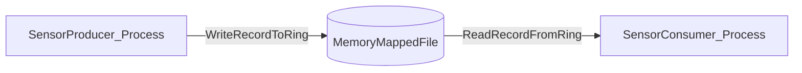

# NanoLink Study Guide: Shared-Memory Lock-Free Sensor Stream (C# / Windows)

This document is written so you can paste it into **ChatGPT Study Mode** and ask questions while learning. It describes **what the system is**, **how the pieces interact**, and **how the low-level lock-free + shared-memory mechanics work**.

## 1) What you built (one sentence)
Two Windows processes exchange **variable-size sensor messages** through a **shared-memory** region using a **lock-free SPSC (single-producer / single-consumer) ring buffer** with a **two-phase commit** record format.

## 2) When to use this pattern
- **Low latency** IPC on the same machine (no kernel crossings per message after setup)
- **High throughput** streaming: sensors, telemetry, audio frames, trading feeds, robotics
- You want **predictable performance** (avoid mutex blocking in the hot path)

## 3) What “technologies” are used here
### Windows / OS-level
- **Named shared memory** via .NET `MemoryMappedFile`:
  - Backed by a Windows **section object** (“file mapping object”).
  - Each process maps a **view** into its own virtual address space.
  - Both views refer to the same physical pages: producer writes become consumer reads.

### .NET / C# runtime techniques
- **Unsafe code + raw pointers** (`byte*`) for minimal overhead
- **Acquire/release memory ordering** via `Volatile.Read` / `Volatile.Write`
- **Interlocked increment** for a shared drop counter
- `Stopwatch.GetTimestamp()` (QPC) for high-resolution timestamps
- `ArrayPool<byte>` to avoid per-message allocations in the producer/consumer demos

### Concurrency concepts
- **Ring buffers / circular buffers** with a power-of-two capacity
- **Monotonic counters** (`head`/`tail`) instead of wrapped indices
- **Two-phase commit** to prevent reading partially-written variable-size records
- **False sharing avoidance** (separate cache lines for producer-written vs consumer-written fields)

## 4) Repo structure (what code lives where)
### Library: `NanoLink.Ring`
This is the reusable part: shared memory layout + ring algorithm.

- `src/NanoLink.Ring/SharedRingLayout.cs`
  - Defines the binary header structure and helper math (power-of-two, offset masking, alignment).
- `src/NanoLink.Ring/SharedMemoryRingMap.cs`
  - Creates/opens the `MemoryMappedFile`, maps a view, and exposes `Header*` and `RingBase`.
- `src/NanoLink.Ring/SpscByteRing.cs`
  - Implements the lock-free variable-size SPSC ring protocol (write/read, wrap marker, two-phase commit).
- `src/NanoLink.Ring/Class1.cs`
  - A tiny internal `Throw` helper for exceptions.

### Apps
- `src/SensorProducer/Program.cs`
  - Generates variable-size “sensor messages”, timestamps them, writes to ring, prints throughput/drops.
- `src/SensorConsumer/Program.cs`
  - Reads messages, validates sequence gaps, computes latency percentiles, prints stats.
- `src/SensorConsumer/LatencyStats.cs`
  - Stores a window of latency samples, sorts to compute p50/p95/p99.

## 5) System dataflow (mental model)



Key point: after initialization, the hot path is “just memory” + a handful of atomics.

## 6) The shared memory layout (bytes on the wire)
The memory-mapped region looks like this:

```
| Header (256 bytes) | RingBytes (capacityBytes) |
```

### Header fields (shared between processes)
Defined in `SharedRingLayout.Header` (explicit layout, 256 bytes total):
- `Magic`, `Version`, `CapacityBytes`: initialization/compatibility checks
- `HeadBytes`: total bytes published by producer (monotonic counter)
- `TailBytes`: total bytes consumed by consumer (monotonic counter)
- `DroppedWrites`: producer increments when ring is full (drop-newest policy)

### Why power-of-two capacity matters
The ring uses a fast wrap operation:

```
offset = absoluteCounter & (capacityBytes - 1)
```

This only works if `capacityBytes` is a power of two.

## 7) Variable-size record format (framing)
Inside the ring byte array, each message is stored as a framed record:

```
| RecordHeader | PayloadBytes... | (padding to 8-byte alignment) |
```

`RecordHeader` (in `SpscByteRing`) contains:
- `Length` (int):
  - `> 0`: committed record; value is payload length
  - `< 0`: in-progress record; absolute value is payload length
  - `int.MinValue`: special “wrap marker”
- `Type` (int): message type (demo uses `1`)
- `TimestampQpc` (long): producer timestamp using `Stopwatch.GetTimestamp()`
- `Sequence` (int): increasing sequence number

### Alignment
Total record size is rounded up to 8 bytes to keep subsequent headers aligned:
`AlignUp8(headerBytes + payloadLen)`.

## 8) The lock-free protocol (SPSC)
This is **single producer** + **single consumer**, which is why the protocol can be simple and fast.

### Core invariant
At all times:
- `0 <= (HeadBytes - TailBytes) <= CapacityBytes`

Where:
- `HeadBytes` only increases (producer).
- `TailBytes` only increases (consumer).

### Producer write algorithm (conceptual)
1. Read `HeadBytes` (producer-local).
2. Read `TailBytes` (to compute free space).
3. If not enough free space: increment `DroppedWrites` and return false (drop-newest).
4. Compute ring offset = `head & (cap-1)`.
5. If the record would cross the end of the ring:
   - write a **wrap marker** and advance `HeadBytes` to the next “cycle” (offset 0).
6. **Two-phase commit**:
   - write header with negative `Length` (in-progress)
   - write payload bytes
   - write `Length` positive (commit)
7. Publish new `HeadBytes` (release write).

### Consumer read algorithm (conceptual)
1. Read `TailBytes`.
2. Read `HeadBytes` (to see if anything is available).
3. Compute offset.
4. If next item is a wrap marker: advance `TailBytes` to offset 0 and retry later.
5. Read `Length`:
   - if negative: producer hasn’t committed; treat as “not available yet”
   - if positive: safe to read payload
6. Copy payload into caller buffer.
7. Advance `TailBytes` (release write).

## 9) Low-level memory ordering: why `Volatile` is used
### What problem memory ordering solves
CPUs and compilers may reorder memory operations. Without ordering, the consumer could observe:
- updated `HeadBytes` (meaning “new data exists”)
- but still see stale payload bytes (because payload writes weren’t yet visible)

### The two “publish points” used here
1. **Per-record commit**: `Length` becomes positive.
2. **Ring publish**: `HeadBytes` advances.

`Volatile.Write` acts like a **release**: “all previous writes in this thread become visible before this write.”
`Volatile.Read` acts like an **acquire**: “all subsequent reads in this thread see what the other thread published.”

In practice for SPSC:
- Producer uses `Volatile.Write` when committing `Length` and when publishing `HeadBytes`.
- Consumer uses `Volatile.Read` to check `HeadBytes` and `Length`.

## 10) IPC setup details (Windows)
In `SharedMemoryRingMap.CreateOrOpen(...)`:
- `MemoryMappedFile.CreateOrOpen(name, size)`:
  - If first process: creates the mapping (allocates a section object).
  - If second process: opens existing mapping by name.
- `CreateViewAccessor(0, size)` maps a view of the section into the process address space.
- `SafeMemoryMappedViewHandle.AcquirePointer(...)` exposes a raw pointer to the mapped bytes.

### Initialization safety
This repo uses a simple “initialize if needed” approach:
- If `Magic/Version/Capacity` don’t match, the mapping is re-initialized.
- This is adequate for the demo, but production designs often use an init flag + sequence to avoid races during startup.

## 11) How the demo measures performance
### Producer
- Generates variable message sizes with `--min/--max`.
- Timestamps each message using QPC (`Stopwatch.GetTimestamp()`).
- Writes at a target rate `--rate` using a simple tick-based pacing loop.
- Prints sent rate, drops, and ring occupancy.

### Consumer
- Reads messages and computes latency:
  - \( latencyNs = (StopwatchNow - producerTimestamp) * (1e9 / Stopwatch.Frequency) \)
- Stores a window of latencies (`--window`), sorts, prints p50/p95/p99.
- Detects sequence gaps.

Important: printing + sorting adds overhead; keep report rate low to avoid measuring “printf latency”.

## 12) How to run (reference)
Build:
- `dotnet build -c Release NanoLink.sln`

Run consumer (terminal 1):
- `dotnet run -c Release --project src/SensorConsumer -- --map Local\\NanoLink.SensorRing --cap 1048576 --maxmsg 4096 --reportHz 1 --window 200000`

Run producer (terminal 2):
- `dotnet run -c Release --project src/SensorProducer -- --map Local\\NanoLink.SensorRing --cap 1048576 --rate 50000 --min 32 --max 512`

## 13) Design constraints and pitfalls (things to ask about in Study Mode)
- **SPSC limitation**: multiple producers or consumers requires a different algorithm (MPSC/MPMC with per-slot sequence numbers).
- **Busy waiting**: `Thread.Yield()` trades CPU for latency; other strategies include `SpinWait`, backoff, or eventing (but eventing adds latency).
- **Drop policy**: current is “drop newest”. Alternatives: “drop oldest”, “overwrite”, or “block”.
- **Variable-size complexity**: wrap markers + padding are required because records must be contiguous.
- **Message max size**: consumer needs a buffer big enough (`--maxmsg >= producer max`).
- **Initialization races**: robust startup often needs a handshake state machine.
- **NUMA / core placement**: can strongly affect p99 latency (cache migration).
- **GC**: even with `ArrayPool`, allocations elsewhere can introduce latency spikes.

## 14) Suggested Study Mode question prompts (copy/paste)
Use these with Study Mode to go step-by-step:
- “Explain how `MemoryMappedFile` maps memory across processes on Windows at the kernel level.”
- “Walk through one successful `TryWrite` call with a payload that fits, explaining each volatile write/read.”
- “Walk through the wrap marker case and show how producer/consumer advance head/tail.”
- “Why are `HeadBytes` and `TailBytes` monotonic longs instead of int indices?”
- “What correctness guarantees does two-phase commit provide? What bugs would happen without it?”
- “How would you extend this design to MPSC or MPMC?”


